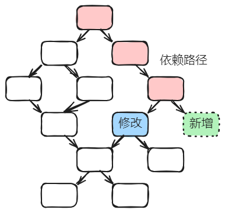
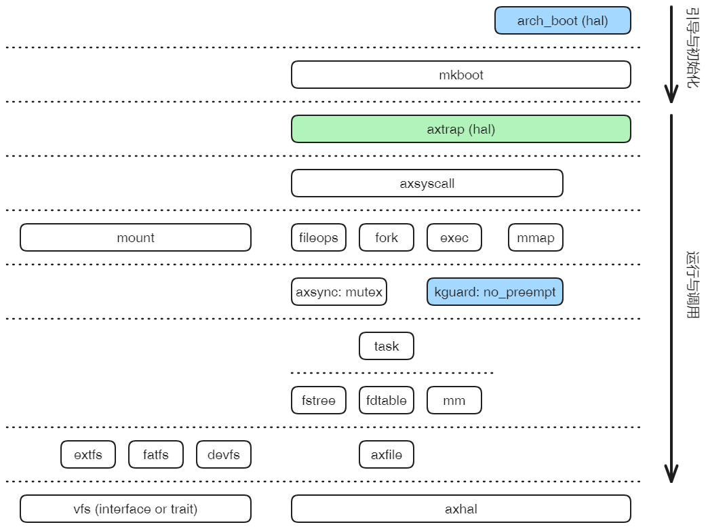
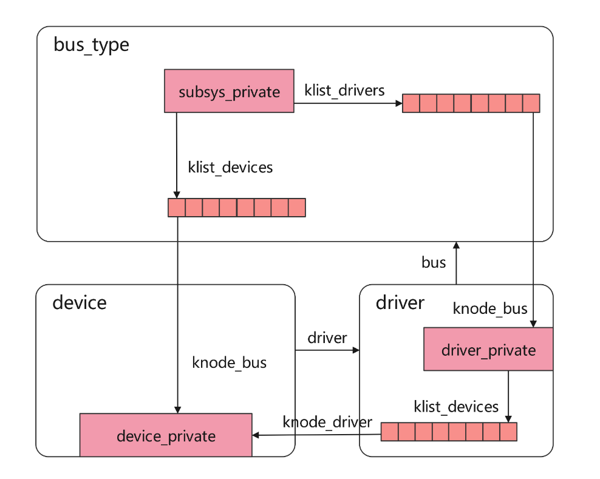

### 工作目标

建立一个**合理**的内核组件化参考模型，包括两方面：

1. 组件的合理划分，相互关系简单，耦合度低
2. 组件接口的相对简单性和相对稳定性

### **合理**的标准或者说约束

组件之间是**单向依赖**，每个组件接口包含的函数或方法能够**归约**到少数的几个。

组件间单向依赖希望达成的效果：

1. 作为达到组件间松耦合状态的一种限制和约束。
2. 有利于自底向上进行测试和形式化验证。底层组件的测试验证作为上层的基础，修改或者新增组件，只影响上层依赖路径上的组件。

### 验证方法

1. 实现核心的组件，定义初级的接口。应当符合上述要求。
2. 选择一些典型的syscall或内部功能进行支持，过程中将涉及各层次组件的增加和现有组件功能的扩展，以及接口的扩展。该过程中，组件间的单向依赖关系基本保持，不会导致明显的循环依赖；原有接口基本稳定，基本不会涉及大的接口修改。

### 单向依赖的定义

组件包含结构类型定义(struct等)和逻辑操作(functions/methods/macros)，它们之间的依赖源于以下三个方面：

1. 结构体类型定义之间的依赖：例如B结构是A结构的一个成员的类型，那么A依赖B。
2. 逻辑操作之间的依赖：逻辑操作代码段A引用代码段B，那么A依赖B。
3. 逻辑操作对结构类型的依赖：代码段A操作结构B类型的对象，那么A依赖B。

**约束**：组件间产生依赖**同时满足**上述三个要求。

**策略**：合理安排结构类型定义与逻辑操作代码段在组件间的分布，或称布局问题。

**具体目标**：

1. 尝试消除crate_interface

   目前有四个地方用到它解决底向上的反向依赖：

   (1)axfs有一个对类似FUSE模式的支持

   (2)axlog实现的支持

   (3)对handle_irq和handle_page_fault的支持

   (4)抢占开关的支持，对着axtask中的current task

   前两点目前看关系不大，重点解决后两个。第3已经实验了，待大家pull验证。

2. 避免注册回调的方式

   这种目前看也是某种反向的依赖。

3. XXX

### 组件实现状态

1. 绿色代表实验完成：如axtrap，下面的任务0
2. 蓝色代表准备进行：如arch_boot和no_preempt，分别是下面的任务1和2

### 任务列表

- [x] trap/irq/syscall从axhal拆分

axtrap组件位于mkboot和axsyscall两个层次之间。解决这部分的反向依赖。

已经实验，从axhal拆分出axtrap处理except/irq/syscall，位置接近最顶层，在mkboot和axsyscall之间位置。

- [ ] boot组件拆分

boot顶级组件 -> mkboot(axruntime) -> (app)。。解决boot这部分的反向依赖。

- [ ] NoPreemt组件放到操作层与资源层之间

NoPreempt(kernel_guard)与Mutex(axsysn)并列。解决关闭抢占这部分的反向依赖。

- [ ] axmount组件的进一步拆分

把fs模块拆出来，放到crates目录下面，作为一个单独的组件。fs模块的位置应该在file组件之下，当然也是在资源层之下。

- [ ] Aarch64支持

能够运行，验证HAL相关部分的剥离"干净"。

当前问题：从内核切换到用户态这步不对。

### 可能遇到的问题

1. 有可能遇到结构的自引用，例如主线程和子线程Task之间的相互引用，但是这个应该不属于循环引用，因为都是Task类型，依赖只发生在组件的内部的结构体自我引用，与组件外没有依赖。

2. 总线/设备/驱动这部分，尚未分析和验证，如果照搬Linux kernel，就很麻烦。

   

   这类可能是需要重点考虑的问题。但是Linux Kernel不是唯一的设计，它是在**没有单向依赖约束下**考虑的设计；如果在约束下，有可能找到其它的合理方案。

3. XXX
